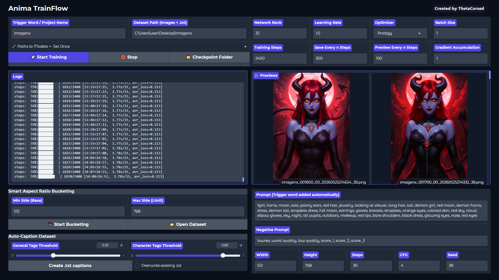

# Anima TrainFlow

Anima TrainFlow is a streamlined, one-page GUI for training LoRA on the **Anima 2B** model. Optimized to run on hardware with as little as **6GB of VRAM**, it eliminates technical overhead by focusing on the essential settings that impact training results the most.



## Quick Start (Portable)
1. [**Download Portable Version (3.1GB)**](https://huggingface.co/datasets/ThetaCursed/Anima-TrainFlow-Portable/resolve/main/Anima-TrainFlow-v1.1.0-Portable.7z?download=true)
2. **Extract the archive using [7-Zip](https://7-zip.org/) or WinRAR**.
3. Run `start_trainer.bat`.
4. Open the `🔧 Paths to Models <- Set Once` accordion and specify the paths to your model files.
5. Specify your **Dataset Path** (images + .txt files) and **Trigger Word**, then click **Start**.

## Manual Installation
If you prefer to set up the environment manually instead of using the portable version, follow these steps:

1. **Clone the repository:**
   ```bash
   git clone https://github.com/ThetaCursed/Anima-TrainFlow
   cd Anima-TrainFlow
   ```

2. **Install dependencies:**  
   Run `Install_Requirements.bat`

3. **Download Required Models:**
   Run the following commands from the root folder:

   **WD Tagger** (used for auto-captioning):
       ```bash
       git clone https://huggingface.co/SmilingWolf/wd-eva02-large-tagger-v3 models/wd-eva02-large-tagger-v3
       ```
   **U2Net Model** (used for Smart Cropping):
       ```bash
       curl -L -o models/u2net/u2net.onnx https://github.com/danielgatis/rembg/releases/download/v0.0.0/u2net.onnx
       ```

4. **Launch the Trainer:** 
   Run `start_trainer.bat`

## Key Features
* **Zero-Tab Interface:** All critical parameters (Trigger Word, Rank, LR, Steps) are accessible on a single screen.
* **Live Training Previews:** Watch your LoRA improve in real-time. The built-in gallery automatically updates whenever a new sample is generated.
* **AI-Powered Smart Cropping:** Integrated U2Net model automatically performs subject-aware, head-first cropping and resizes images to optimal aspect-ratio buckets via multi-threading.
* **Built-in Auto-Captioning:** Integrated WD14 Tagger (EVA02 v3) automatically generates multi-threaded `.txt` tags for your dataset with customizable general and character thresholds.
* **Pre-Flight Validation:** Automatically scans the dataset for missing captions, oversized images (>=2048px), and missing model paths to prevent crashes before training starts.
* **Persistent Sessions:** All UI inputs, paths, and slider positions are instantly auto-saved and restored on the next launch.
* **Portable Edition:** Includes an embedded Python environment to avoid installation or complex setup.
* **Low VRAM Friendly:** Specifically tuned for 6GB+ NVIDIA GPUs with aggressive RAM/VRAM clearing between tasks.
* **Optimized Defaults:** Pre-configured for BF16 precision and latent caching to ensure maximum performance and stability.
* **Prodigy Native:** Intelligent Learning Rate handling and optimized defaults for the Prodigy optimizer.

## Dataset Preparation
Place all your training images (.png, .jpg, .webp) in a single folder. Every image must have a matching text file with the same name containing its tags/captions (e.g., `image1.png` and `image1.txt`). You can easily generate these text files using the built-in **Auto-Caption Dataset** tool.

## System Requirements
* **OS:** Windows 10/11.
* **GPU:** NVIDIA GPU (6GB+ VRAM recommended for Anima 2B training).
* **Storage:** ~6.5GB of free space (SSD recommended).

## Technical Details
* **Core:** Based on a modified version of `sd-scripts` for Anima 2B architecture.
* **UI:** Built with Gradio featuring a customized dark theme.
* **Backend:** Utilizes `accelerate launch` for optimized execution.
* **Auto-Save:** All paths and configurations are automatically saved to `settings.json`.